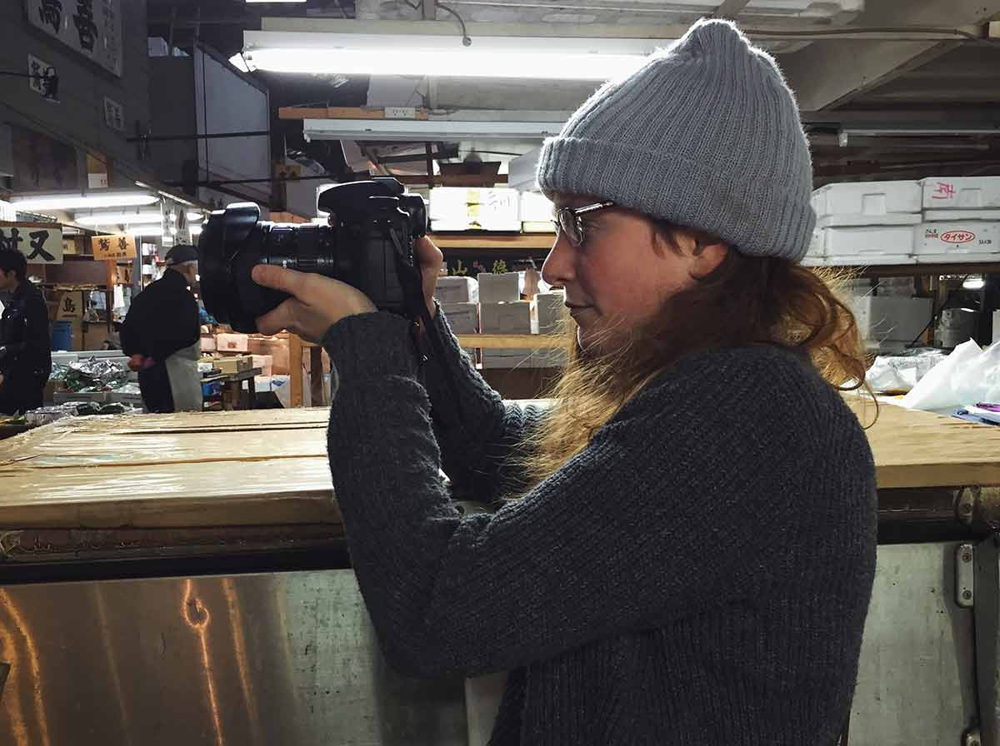

I worked in brand management for several years before concentrating solely on filmmaking. Marketing experience combined with strong people skills means that I’m particularly good at really understanding your needs and translating them into a scintillating visual story.

I’ve worked with foreign language contributors and have experience shooting in a range of countries; from Malaysia, South Africa, Japan and the UK, by myself or as a part of a crew ranging from three to sixteen. I have also worked with talent, which includes pop band One Direction and TV presenter Jonathan Ross, and enjoy working both independently and as part of a team.

I have won awards in the Africa in Motion Film Festival (director) and the London 48 Hour Film Competition (producer).

Please feel free to reach out and start a conversation, I’m always happy to meet new people.

### Social Media

* [Instagram](https://www.instagram.com/falling_gracefully/)
* [Twitter](https://twitter.com/Films_FG)
* [Youtube](https://www.youtube.com/channel/UCQRp126u4rBdf432OMEfQOQ)
* [Behance](https://www.behance.net/graceodonn6a84)
* [Linkedin](https://www.linkedin.com/in/grace-o-donnell-8888a640/)

### Media

* [That Travel Blog](http://www.thattravelblog.com/blog/how-to-make-money-while-travelling-falling-gracefully?utm_content=bufferc8f49&utm_medium=social&utm_source=twitter.com&utm_campaign=buffer
)
* [Girlcrew Podcast](https://t.co/ZZMO3lC3lA)
* We Are Digital Nomads

<a class="contact-btn" href="{{ "contact" | relative_url}}">Get in touch!</a>
